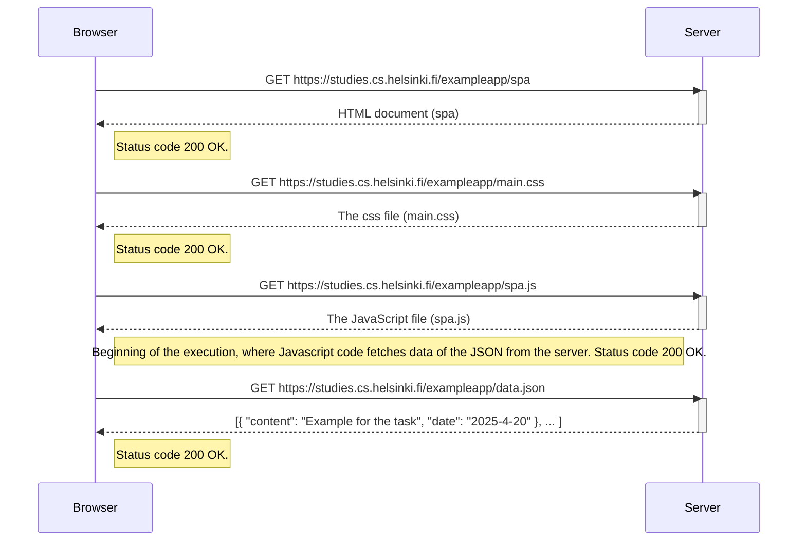

```mermaid
sequenceDiagram
    participant Browser
    participant Server

    Browser->>Server: GET https://studies.cs.helsinki.fi/exampleapp/spa
    activate Server
    Server-->>Browser: HTML document (spa)
    deactivate Server

    Note right of Browser: Status code 200 OK. 
    
    Browser->>Server: GET https://studies.cs.helsinki.fi/exampleapp/main.css
    activate Server
    Server-->>Browser: The css file (main.css)
    deactivate Server

    Note right of Browser: Status code 200 OK. 
    
    Browser->>Server: GET https://studies.cs.helsinki.fi/exampleapp/spa.js
    activate Server
    Server-->>Browser: The JavaScript file (spa.js)
    deactivate Server
    
    Note right of Browser: Beginning of the execution, where Javascript code fetches data of the JSON from the server. Status code 200 OK. 
    
    Browser->>Server: GET https://studies.cs.helsinki.fi/exampleapp/data.json
    activate Server
    Server-->>Browser: [{ "content": "Example for the task", "date": "2025-4-20" }, ... ]
    deactivate Server

    Note right of Browser: Status code 200 OK. 
```
