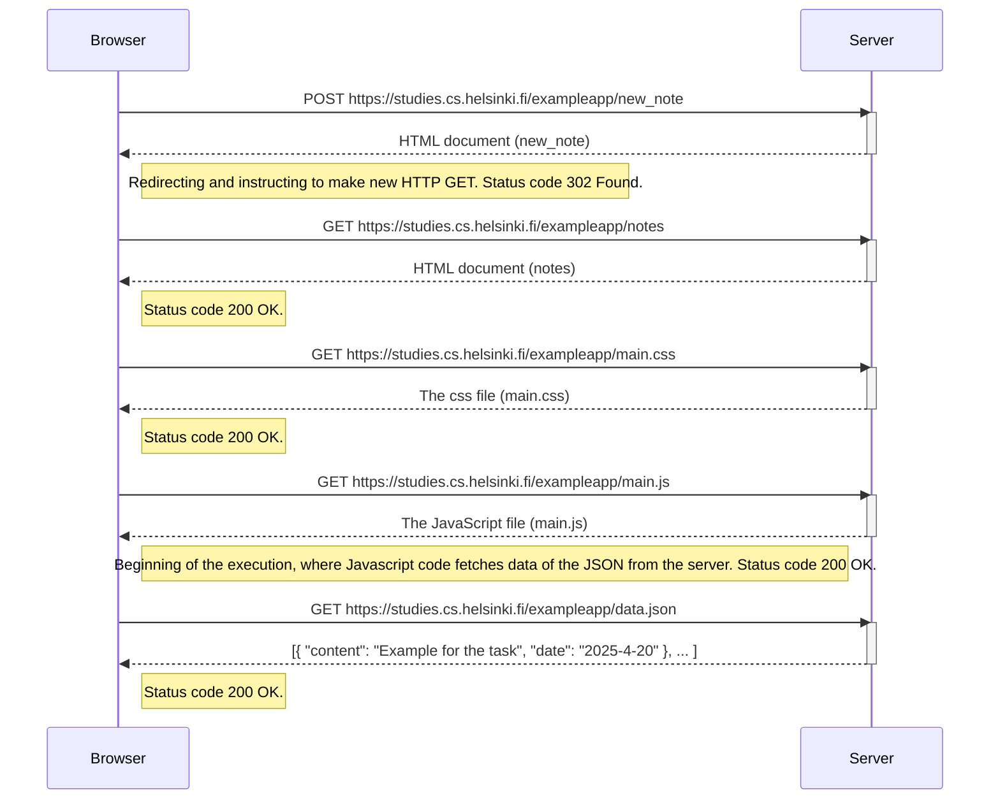

```mermaid
sequenceDiagram
    participant Browser
    participant Server

    Browser->>Server: POST https://studies.cs.helsinki.fi/exampleapp/new_note
    activate Server
    Server-->>Browser: HTML document (new_note)
    deactivate Server

    Note right of Browser: Redirecting and instructing to make new HTTP GET. Status code 302 Found.

    Browser->>Server: GET https://studies.cs.helsinki.fi/exampleapp/notes
    activate Server
    Server-->>Browser: HTML document (notes)
    deactivate Server

    Note right of Browser: Status code 200 OK. 
    
    Browser->>Server: GET https://studies.cs.helsinki.fi/exampleapp/main.css
    activate Server
    Server-->>Browser: The css file (main.css)
    deactivate Server

    Note right of Browser: Status code 200 OK. 
    
    Browser->>Server: GET https://studies.cs.helsinki.fi/exampleapp/main.js
    activate Server
    Server-->>Browser: The JavaScript file (main.js)
    deactivate Server
    
    Note right of Browser: Beginning of the execution, where Javascript code fetches data of the JSON from the server. Status code 200 OK. 
    
    Browser->>Server: GET https://studies.cs.helsinki.fi/exampleapp/data.json
    activate Server
    Server-->>Browser: [{ "content": "Example for the task", "date": "2025-4-20" }, ... ]
    deactivate Server

    Note right of Browser: Status code 200 OK. 
```
