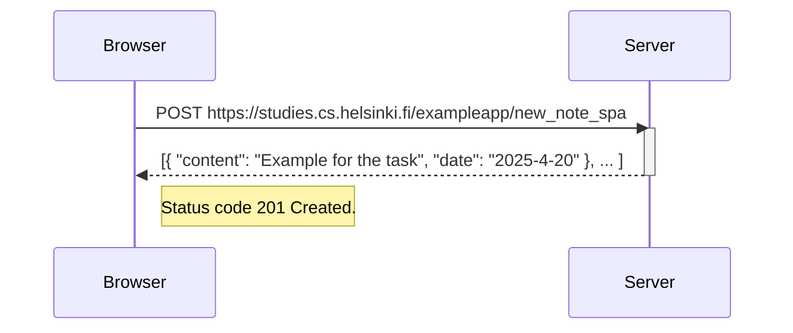

```mermaid
sequenceDiagram
    participant Browser
    participant Server
    
    Browser->>Server: POST https://studies.cs.helsinki.fi/exampleapp/new_note_spa
    activate Server
    Server-->>Browser: [{ "content": "Example for the task", "date": "2025-4-20" }, ... ]
    deactivate Server

    Note right of Browser: Status code 201 Created. 
```
